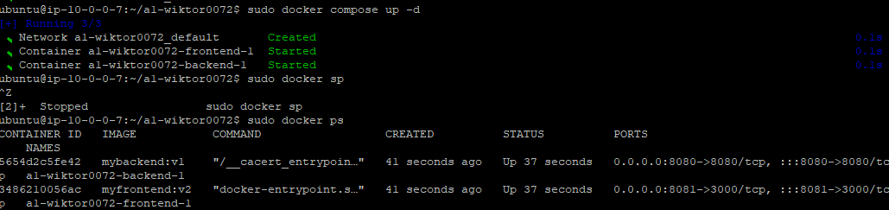

# Wiktor Tomczyk - Terraform, EC2, TicTacToe report

- Course: *Cloud programming*
- Group: W04IST-SI0828G
- Date: 20.04.2024

## Environment architecture

Description and scheme of the developed infrastructure.

## Preview

Screenshots of configured AWS services. Screenshots of your application running.

## Reflections

- What did you learn?
- What obstacles did you overcome?
- What did you help most in overcoming obstacles?
- Was that something that surprised you?
