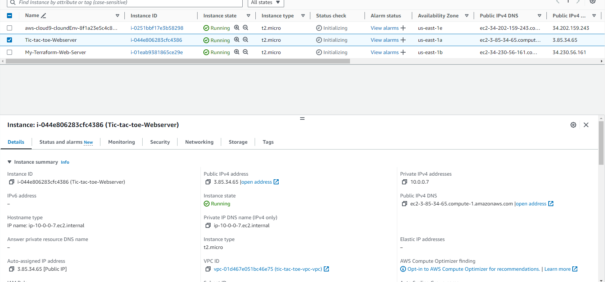
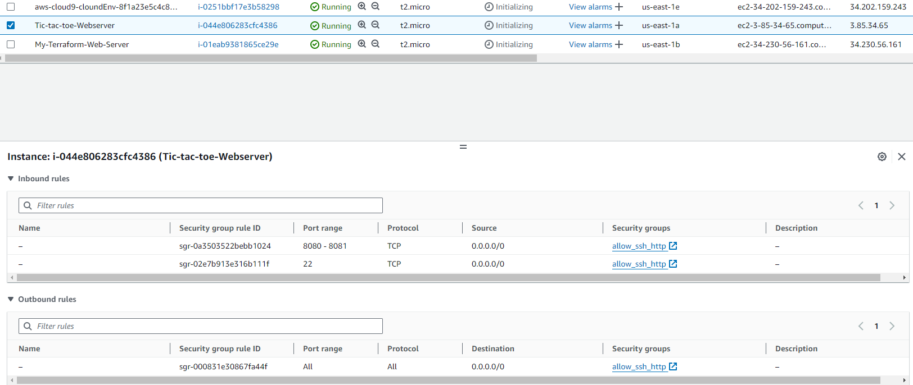
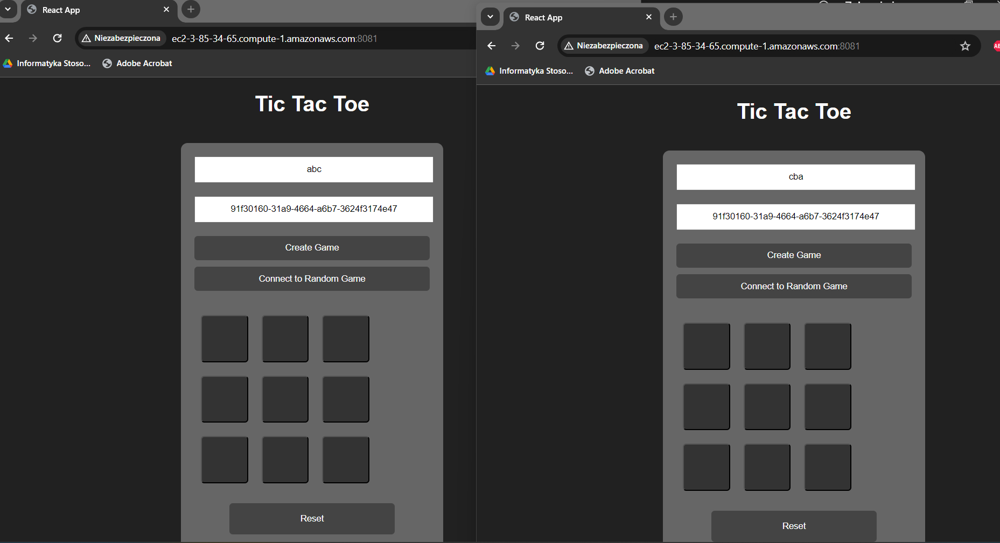
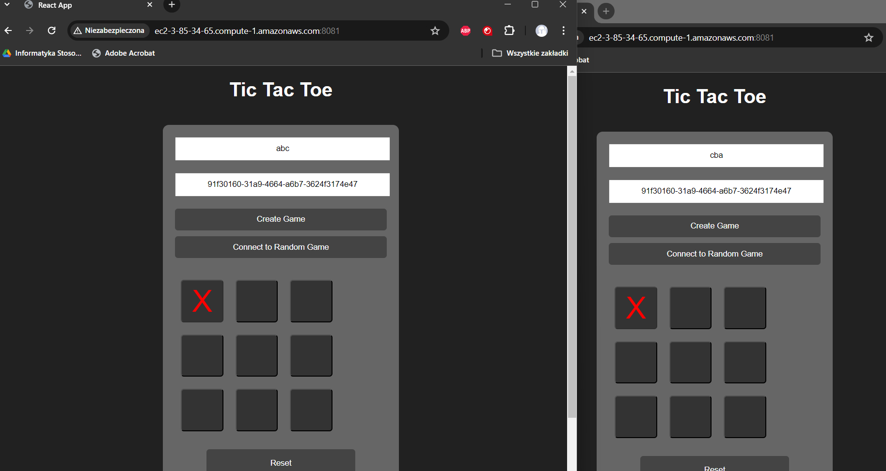
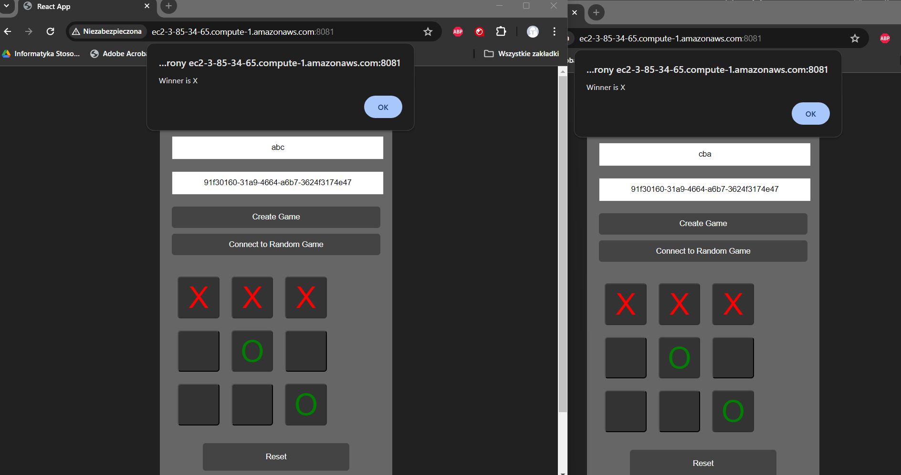

# Wiktor Tomczyk - Terraform, EC2, TicTacToe report

- Course: *Cloud programming*
- Group: W04IST-SI0828G
- Date: 20.04.2024

# Environment architecture

## Virtual Private Cloud (VPC):
  * Created a VPC in AWS, functioning as an isolated private network for the infrastructure.
## EC2 Instance:
  * Using Terraform, provisioned an EC2 instance in the VPC's public subnet.
  * On the EC2 instance, Docker environment was deployed, hosting containers with the game.
## Docker Containers:
  * Docker containers running on the EC2 instance hosted the game.
  * Docker containers were run by Docker Compose
## Security Groups:
  * Configured security groups in order to allow to open the address in internet browser

# Preview

Screenshots of configured AWS services. Screenshots of your application running.

# Reflections

In this project, I learned:

- How to use Terraform to provision infrastructure on AWS.
- How to deploy Docker containers on an EC2 instance.
- How to manage infrastructure as code using Terraform.
- How to use Docker compose
  
I overcame several obstacles during the project, including:

- Understanding the intricacies of Terraform configuration.
- Troubleshooting Docker container issues.
- Configuring security groups and network settings in AWS.
- Understanding how docker compose works and what files it needs
- Creating proper configure script
  
To overcome these obstacles, I found the following resources most helpful:

- StackOverflow
- youtube tutorials
- teacher's guides
- other internet forums
  
